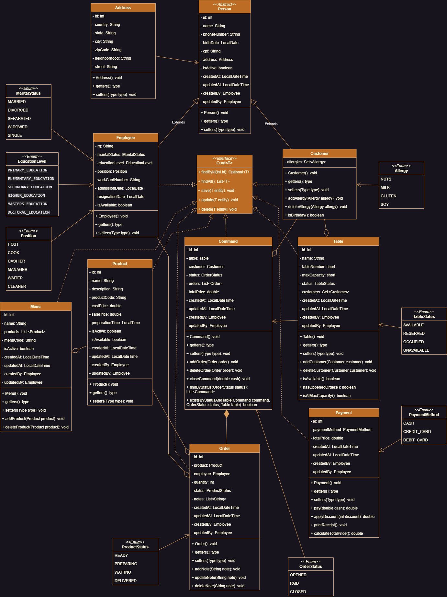

# Restaurant Management System

This repository contains the source code and documentation for a comprehensive Restaurant Management System, developed as
part of the +Devs2Blu course. The objective of this project is to provide a robust and user-friendly solution for
managing tables in a restaurant setting. The system is implemented in Java, leveraging its object-oriented capabilities
to ensure extensibility and maintainability.

## Functional Requirements:

- **RF01 - The system should allow the inclusion/exclusion/update/listing of employees. The employee information includes:**

    - Name;
    - Phone;
    - Date of birth;
    - CPF;
    - RG;
    - Marital status;
    - Education;
    - Job position;
    - Work permit number;
    - Date of hiring;
    - Date of termination;
    - Availability (occupied/available);
    - Status (active/inactive).
---

- **RF02 - The system should allow the management of customers. The customer information includes:**

    - Name;
    - Phone;
    - Date of birth;
    - CPF;
    - Address;
    - Observation;
    - Status (active/inactive).
---

- **RF03 - The system should allow the management of tables (allocation, reservation, release). The table information includes:**

    - Employee assigned to the table;
    - Name;
    - Code;
    - Number;
    - Table status (free/reserved/occupied);
    - Maximum capacity.
---

- **RF04 - The system should allow the management of orders. The order information includes:**

    - Table associated with the order;
    - Customer associated with the order;
    - List of products linked to the order;
    - Order status (open/paid/closed);
    - Order code;
    - Total order value.
---

- **RF05 - The system should allow the management of products. The product information includes:**

    - Name;
    - Description;
    - Code;
    - Cost price;
    - Selling price;
    - Preparation status (ready/preparing/waiting);
    - Preparation time (estimated preparation time);
    - Observations;
    - Status (active/inactive).
---

- **RF06 - The system should allow the management of menus. The menu information includes:**

    - Name;
    - List of products in the menu;
    - Code;
    - Status (active/inactive).
---

- **RF07 - The system should allow the association of products with a menu.**
---
- **RF08 - The system should allow adding products to an order, specifying the quantity consumed.**
---

## Non-Functional Requirements:
- **RNF01 - The system should be developed in Java.**
---
- **RNF02 - The system should be auditable, with audit fields in all classes.**
---
- **RNF03 - The system should be developed using object-oriented best practices.**
---

## Business Logic:
- **RN01 - Apply a 10% discount to an order when it is closed and the customer's birthday falls in that month.**
---
- **RN02 - An order cannot be closed if it contains unpaid items.**
---
- **RN03 - Before reserving a table, check if there are no orders associated with it.**
---
- **RN04 - Before changing the status of a table from occupied to free, check if there are no open orders on that table.**
---
- **RN05 - Automatically recalculate the order value whenever a new product is added to an order.**
---
- **RN06 - A customer can only be assigned to a table if the customer's status is not inactive.**
---
- **RN07 - Waiter can list the existing customers at a table.**
---
- **RN08 - Manager can check the orders of a table based on their status (open/closed/paid).**
---
- **RN09 - When an employee is deleted, mark them as inactive internally.**
---

## Class Diagram

